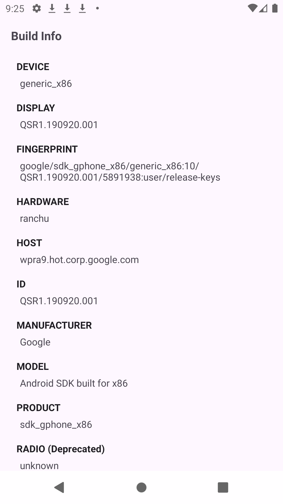
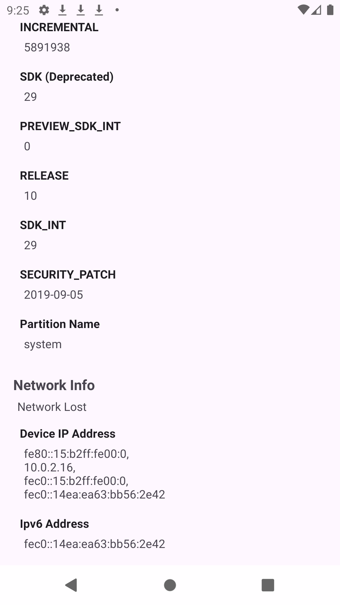

# Android Device Information App

This app is designed to retrieve and display detailed information about an Android device. It collects various system properties and settings, including device build info, hardware details, network configurations, and more, presenting it in a user-friendly interface.

### Features

- **Device Build Info**: Displays essential information such as device name, manufacturer, model, and build fingerprint.
- **Display and Fingerprint**: Shows display build version, fingerprint, and system build information.
- **Hardware & Manufacturer Details**: Reveals hardware configuration, manufacturer, and model of the device.
- **Network Information**: Displays IP addresses and network-related information like IPv6 addresses and connectivity status.
- **System Version Details**: Provides details on the Android SDK version, security patch level, and build ID.


### Screenshots:
 <p align="center">
    <a>
      
    </a>
    <a>
      
    </a>
  
  </p>


### Find this Repository useful? ❤️
Support it by joining stargazers for this repository. ⭐

Also, [follow me on GitHub](https://github.com/AndroidWithRossyn/) for my next creations! 🤩


### Copyright & License
```
© 2024 Rossyn. All rights reserved.

Licensed under the Apache License, Version 2.0 (the "License");
you may not use this file except in compliance with the License.
You may obtain a copy of the License at

   http://www.apache.org/licenses/LICENSE-2.0

Unless required by applicable law or agreed to in writing, software
distributed under the License is distributed on an "AS IS" BASIS,
WITHOUT WARRANTIES OR CONDITIONS OF ANY KIND, either express or implied.
See the License for the specific language governing permissions and
limitations under the License.
```

<p align="center">
  
</p>
